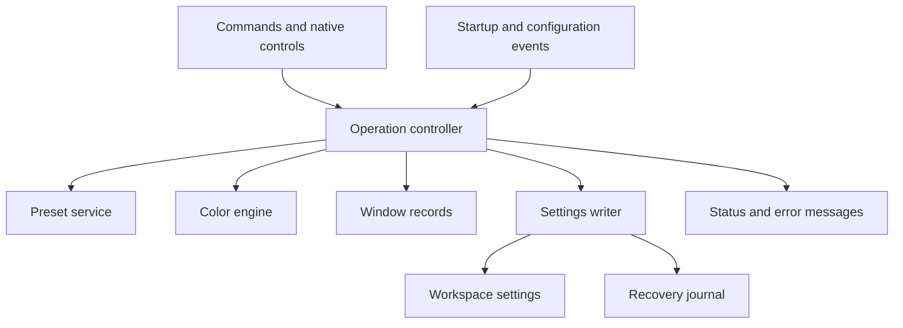

# iroiro iro: Design

| Item | Value |
| --- | --- |
| Document ID | IRO-DES-001 |
| Revision | 0.1 |
| Date | 2026-09-05 |
| Status | Draft for review |
| Product | iroiro iro (色々色) |
| Release | 1 |
| Companion | [Requirements](requirements.md) |

## 1. Purpose

iroiro iro changes the colors of selected parts of a Visual Studio Code window. Different colors help the user identify open workspaces.

The user can select a preset, enter a hex code, or request a random color. The extension saves the selected color for that workspace. When the workspace opens again, the extension restores that color.

This document defines the implementation design. The requirements document defines the product obligations, reference data, and verification criteria. This revision contains no implementation results.

## 2. Scope and decisions

### 2.1 User decisions

| Decision | Agreed behavior |
| --- | --- |
| U-01 | Deliver a VS Code extension that makes workspace color changes fast and simple. |
| U-02 | Restore the saved color when a project opens again. |
| U-03 | Make automatic color assignment optional. Offer preset selection and random generation. |
| U-04 | Use one primary color. Use related shades where necessary for readability. |
| U-05 | Support VS Code desktop on Windows, macOS, and Linux. Include Remote SSH, WSL, and Dev Containers. |
| U-06 | Save workspace colors in `.vscode/settings.json` or a `.code-workspace` file. |
| U-07 | Apply color to the activity bar, status bar, title bar, and sash hover border by default. |
| U-08 | Use an open folder or workspace for each color change. |
| U-09 | Accept custom colors through hex input. Let the user save a color with a name. |
| U-10 | Prefer different colors for other open workspaces when possible. |
| U-11 | Supply Command Palette commands, including Lighten and Darken. |
| U-12 | Let the user select the parts that receive color. |
| U-13 | Use ASD-STE100 and INCOSE guidance for the documents. |
| U-14 | Use solid hex colors and live previews. Escape restores the previous appearance. |
| U-15 | Supply more than 200 built-in color presets with clear English names. |

U-14 was the stated default in the readiness message. The user then approved document preparation.

The extension applies color to the activity bar, status bar, title bar, and sash hover border by default. The activity bar uses one Lighten step. The status bar, title bar, and sash hover border use the primary color.

### 2.2 Engineering decisions

These decisions define details that the user did not specify. They stay subject to review with this draft.

| ID | Decision | Rationale |
| --- | --- | --- |
| D-01 | Use TypeScript and the stable VS Code extension API. Set the minimum VS Code version to 1.104.0. | One implementation can operate in the desktop environments in scope. |
| D-02 | Run as a local UI extension. | The local host can coordinate local and remote workspace windows. |
| D-03 | Use native Quick Pick, Input Box, settings, and status bar controls. | The user can do common tasks with the keyboard. |
| D-04 | Use the fixed presets in requirements Catalog P. Store custom presets in user settings. | Presets stay available across projects in the current profile. |
| D-05 | Use five HSL lightness percentage points as the default adjustment step. Accept integer steps from 1 through 10. | Small steps help the user change colors. |
| D-06 | Select black or white text from the contrast calculation in Section 9. | The calculation uses a known solid background. |
| D-07 | Use local records for color differences across participating windows. | No account or extension network service is necessary. |
| D-08 | Record prior settings before the first extension write. Restore only values that still match an extension write. | Recovery can keep user changes that occur after an extension write. |
| D-09 | Keep 20 completed appearance changes in Undo history for the current window session. | The user can recover from repeated color adjustments. |
| D-10 | Reset clears the workspace color and disables automatic assignment for that workspace. | The next startup does not immediately replace the Reset result. |
| D-11 | Keep the theme colors for debugger, error, warning, and remote status indicators. | These indicators show states other than workspace identity. |
| D-12 | Use the timing limits in requirements Profile T. | The user target "quick" must have a measurable acceptance criterion. |

### 2.3 Scope limits

Release 1 serves a folder workspace or a workspace that contains one or more folders. A workspace with multiple folders receives one primary color.

Windows that refer to the same workspace settings share their saved color. A separate Git worktree has a separate folder identity. A different remote authority also has a separate identity.

Browser clients, empty windows, VS Code forks, and Live Share integration are outside this release. Color transparency, visual color wheels, and independent colors for each part are also outside this release.

The extension changes workbench color settings. It does not replace the selected theme or the colors of source code text.

## 3. Architecture

### 3.1 Extension host

The extension manifest declares `extensionKind: ["ui"]`. The extension activates through `onStartupFinished` and its command contributions. The implementation uses `engines.vscode: "^1.104.0"`.

Workspace operations use VS Code APIs. Node file operations access only local extension storage. Thus, the extension does not use a remote workspace path as a local file path. This division agrees with the documented extension host model. [Remote extensions](https://code.visualstudio.com/api/advanced-topics/remote-extensions)

### 3.2 Components



| Component | Responsibility |
| --- | --- |
| Operation controller | Orders appearance operations and tracks the active preview. |
| Preset service | Reads the fixed palette and validates custom presets. |
| Color engine | Converts hex input, calculates shades, selects foregrounds, and compares colors. |
| Surface registry | Maps each selected part to a fixed set of VS Code color keys. |
| Settings writer | Prepares changes to owned keys and records prior values. |
| Recovery journal | Records incomplete operations and the last completed appearance. |
| Window records | Supplies a recent view of colors in other participating windows. |
| Status adapter | Shows the current name, hex code, and actionable failures. |

The color engine has no VS Code dependency. Its inputs and outputs are plain data. Tests can supply a fixed random number source and a fixed clock.

The settings writer is the only component that changes workspace settings. The operation controller accepts one appearance operation at a time in each extension instance.

### 3.3 Workspace identity

The identity source is the complete workspace URI. For a single folder, the source is the folder URI. For a saved or untitled workspace, the source is `workspace.workspaceFile`.

The identity includes the URI scheme and authority. The implementation uses the URI string that VS Code supplies. It does not remove case or resolve symbolic links independently.

The coordination key is a SHA-256 hash of the identity source. The hash is an identifier, not a privacy guarantee. Local records do not contain workspace paths.

A saved untitled workspace can receive a new identity. The controller releases the previous window record and adds a new record. Existing workspace settings supply the primary color.

## 4. User interaction

### 4.1 Entry points

Requirements Catalog C defines the command IDs and titles. Each title starts with the category `iroiro iro` in the Command Palette.

The status bar item shows the preset name when a matching preset exists. It also shows the canonical hex code. The item opens Choose Color. The user can hide this item in settings.

The extension contributes no default keyboard shortcut. The user can assign a shortcut to each command through VS Code.

### 4.2 Choose a color

1. Open the Command Palette.
2. Select `iroiro iro: Choose Color`.
3. Enter a name or a hex code in the search field.
4. Move to a preset to see its preview.
5. Press Enter to save the selected color.

The search field filters preset names and canonical hex codes. Arbitrary hex input uses the separate Enter Hex Color command. Search text does not add a new color.

Catalog P defines 240 built-in presets. Each built-in preset has a different English name and canonical hex value. The names describe familiar colors and shades.

The list shows built-in presets first, in Catalog P order. Custom presets follow in normalized name order. Sorting compares Unicode code points without a locale-specific collator.

Each entry contains a name and its canonical hex code. A custom preset can share a value with a built-in or different custom preset. For a status label, the first equal value in this list supplies the preset name.

The current color starts as the active entry when an equal preset value exists. With no equal value, the picker starts at the first preset. This first entry can show a preview.

### 4.3 Enter a hex color

1. Select `iroiro iro: Enter Hex Color`.
2. Enter a solid hex code.
3. Press Enter to save the color.

The input accepts three or six hex digits, with an optional leading `#`. The input removes surrounding whitespace. It accepts uppercase and lowercase digits.

The parser expands short input and writes lowercase six-digit output. For example, `#aBc` becomes `#aabbcc`. The parser rejects alpha channels, color names, and color functions.

Invalid input shows an inline error. It causes no preview or saved change. After valid input stays unchanged for 100 ms, the input can show a live preview.

### 4.4 Preview behavior

A preview changes the actual selected window parts. It uses temporary workspace settings because the public extension API has no window color overlay.

The controller takes one snapshot when a picker opens. Movement through the picker updates the preview after a 100 ms debounce. Only the latest pending color proceeds to the settings writer.

Enter completes the selected change. Escape, picker dismissal, or loss of the workspace cancels the preview. Cancellation restores the snapshot through the ownership rules in Section 7.

The picker sets `ignoreFocusOut` to false. A change to a different application cancels the picker. Cancellation has higher priority than pending preview work.

The extension does not write a preview color to `iroiroIro.color`. A completed selection writes this setting after the color overrides succeed. Preview steps add no Undo entries.

Temporary previews can add visible changes in Git and settings editors. The design restores prior values, not the original byte layout of the settings file. VS Code can keep an empty object or file after cancellation.

### 4.5 Preset management

Save Current Color asks for a name. It adds the current primary color to user presets. Save Current Color also works after a random choice or a shade adjustment.

Rename Preset, Edit Preset Color, and Delete Preset operate only on custom presets. A changed preset does not change existing workspace assignments. The workspace stores a color value, not a reference to a preset.

Names contain 1 through 64 Unicode code points after surrounding whitespace removal. Control characters are invalid. Name comparison uses NFKC normalization followed by Unicode lowercase conversion.

A custom name cannot match a different custom name or a built-in name after this conversion. Display names use NFC normalization. The preset service accepts up to 1,000 valid custom presets.

A name match is invalid before the write. The user can enter a different name in the same Input Box. Deletion asks the user to select the custom preset, then removes that preset.

### 4.6 Undo and Reset

Undo restores the previous completed appearance operation. Color choices, Lighten, Darken, Reset, and changes through Choose Colored Parts add history entries. Preview steps and no-op operations do not.

History contains up to 20 entries for the current window session. It includes the primary color, owned values, colored parts, and affected automatic assignment settings. History excludes custom preset edits and global preference changes.

An external change to the workspace appearance ends the current history chain. Undo then reports that no earlier operation is available. This rule prevents Undo from replacing a later external change.

Reset restores the original recorded values for unchanged owned keys. It removes `iroiroIro.color` from workspace scope. It also writes `iroiroIro.autoColor.enabled: false` at workspace scope.

If a prior value is unknown, Reset removes an owned override only when its value still matches the extension record. An external value written after the extension change stays unchanged.

## 5. Settings

All keys use the prefix `iroiroIro`. A workspace color always has workspace scope. General preferences use VS Code user settings with workspace overrides.

| Key after the prefix | Type | Default | Scope |
| --- | --- | --- | --- |
| `color` | String | Empty string | Explicit workspace value only |
| `autoColor.enabled` | Boolean | `false` | User and workspace |
| `autoColor.source` | `presets` or `generated` | `presets` | User and workspace |
| `preferDistinctColors` | Boolean | `true` | User and workspace |
| `adjustmentStep` | Integer, 1 through 10 | `5` | User and workspace |
| `coloredParts` | Object of part IDs and booleans | Requirements Catalog S | User and workspace |
| `adjustments` | Object of bar IDs and shade modes | Activity bar `lighten`, other bars `none` | User and workspace |
| `presets` | Array of name and value objects | Empty array | User |
| `preview.enabled` | Boolean | `true` | User and workspace |
| `statusBarItem.enabled` | Boolean | `true` | User and workspace |

`adjustments` accepts `activityBar`, `titleBar`, and `statusBar`. Each value is `none`, `lighten`, or `darken`. The configured step also controls these shade adjustments.

The extension reads `color` from `inspect().workspaceValue`. It ignores a global or folder-level value for this property. A window receives one color when its workspace contains multiple folders.

The preset service reads `presets` from `inspect().globalValue`, with an empty list as the default. It ignores workspace overrides for this user-only property.

Enable Automatic Color and Disable Automatic Color ask for the scope. The choices are `This workspace` and `User default`. A workspace override has higher priority than the user default.

A preference change affects the open workspace after the current preview ends. A change that invalidates a preview cancels the preview first. A shade or part preference change keeps the saved primary color.

Invalid scalar preferences use the documented default and give one diagnostic per configuration revision. Invalid custom preset entries are excluded individually. The first valid entry wins when manually edited settings contain duplicate names.

The Settings Sync service can synchronize user preferences and custom presets. Workspace assignments travel with workspace files. The extension does not synchronize journals, history, or window records.

## 6. Data and ownership

### 6.1 Storage locations

| Data | Location | Lifetime |
| --- | --- | --- |
| Primary color | Workspace `iroiroIro.color` | Until replacement or Reset |
| Rendered color values | Workspace `workbench.colorCustomizations` | Until replacement or restoration |
| User presets | User `iroiroIro.presets` | Until user removal |
| Prior values and recovery journal | Extension `workspaceState` | Until successful restoration and journal cleanup |
| Undo history | Extension memory | Current window session |
| Window records | `globalStorageUri/active/v1/` | Current participation plus expiry interval |
| Diagnostics | VS Code log output | Host log retention |

An untitled workspace uses its VS Code workspace configuration. The extension does not add a project folder for an empty window. A failure to save an untitled workspace configuration uses the normal write failure path.

### 6.2 Journal model

The following schema describes internal data. It is not an additional user setting.

```typescript
type StoredValue =
  | { present: false }
  | { present: true; value: unknown };

interface OwnedEntry {
  path: string[];
  before: StoredValue;
  lastWritten: StoredValue;
}

interface AppearanceSnapshot {
  color: StoredValue;
  owned: OwnedEntry[];
  workspacePreferences: Record<string, StoredValue>;
}

interface RecoveryJournal {
  schemaVersion: 1;
  operationId: string;
  phase: "prepared" | "preview" | "committing" | "complete";
  base: AppearanceSnapshot;
  intended: AppearanceSnapshot;
  attemptedWrites: Record<string, StoredValue[]>;
}
```

The journal records absence and values in different fields. Its `base` snapshot describes the appearance immediately before that operation. Each `OwnedEntry.before` field keeps the baseline from before the first ownership write.

The complete workspace record has this structure:

```typescript
interface WorkspaceRecord {
  schemaVersion: 1;
  revision: string;
  committed: AppearanceSnapshot;
  pending?: RecoveryJournal;
}
```

The extension stores the completed ownership snapshot independently of the pending journal. Cancellation restores the snapshot from before the picker, then removes only the pending journal. The ownership baseline stays available for Reset.

The final storage update writes the completed snapshot and clears the pending journal in one `workspaceState` record. Reset uses the original ownership baseline. Undo uses the previous completed history entry.

The writer saves each intended write in the journal before it changes configuration. Thus, recovery can recognize a write if the process stops before the next journal update.

Journal validation includes schema version, known paths, data types, and a 256 KiB size limit. Invalid journal data causes a recovery message and stops automatic writes for that activation.

### 6.3 Owned paths

The surface registry contains the only color keys that the extension can own. A path consists of a color key, or a theme selector followed by a color key.

The writer records the existing value before the first change to a path. The writer marks missing values as absent. A new part selection adds the paths for that part to the record.

When the user deselects a part, the writer restores its unchanged paths. The writer then releases those paths. It does not delete the whole `workbench.colorCustomizations` object.

Theme-specific objects use different paths. The writer reads selectors from the effective merged user and workspace configuration. For each selected key, the writer finds each existing selector that contains that key.

The writer applies that key at workspace scope in the top-level object and in each such selector. If a selector exists only in user settings, the writer adds a workspace object with only the selected keys.

The writer records prior workspace values or their absence for each path. It keeps unrelated selector entries unchanged. Restoration removes unchanged generated entries when their prior workspace values were absent.

A new external selector counts as an external configuration change. The writer does not invent selector names. This behavior prevents a user theme override from hiding the selected workspace color.

### 6.4 External edits

Before a write, the writer reads the latest workspace configuration. It merges only the planned paths into that value. The writer then reads the configuration again to verify its target values.

An event that matches the pending operation's expected values identifies an extension write. The controller does not start a second appearance operation for that event.

Configuration objects use own properties only. The writer rejects prototype-related path segments. A path must contain a registered color key and, optionally, an existing theme selector.

Before restoration, the writer compares each current value with the values that the operation wrote or attempted. A different value indicates an external edit. Restoration keeps that value unchanged.

An external edit to an owned path cancels the active preview. The controller suspends automatic reapplication for the affected part until the user selects a color again. The user receives one message that identifies the affected part.

The public configuration API has no compare-and-swap operation. Independent extensions can change the same setting during a write. Preflight reads, configuration events, and readback decrease this risk but cannot remove it.

The implementation does not continuously overwrite a conflicting extension. A user action can start a new ownership baseline from the current values.

### 6.5 Imported workspaces

A copied workspace can contain a saved primary color without a local ownership journal. The extension recognizes matching generated paths from that color and the effective preferences.

For a matching generated path, the prior value is unknown. Reset can remove that generated override. A different existing value causes a conflict for its part and stays unchanged during startup.

An explicit color selection can acquire the conflicting part. The writer records the existing value as its baseline before this write.

The extension cannot recover settings history that a different installation did not supply. This limit also applies after the user removes extension storage.

## 7. Operation lifecycle

### 7.1 Startup

The controller uses this order:

1. Validate the stored recovery data.
2. Recover an interrupted local operation, if necessary.
3. Read the workspace identity and effective preferences.
4. Read the explicit saved primary color.
5. Restore a valid saved color for parts without an external conflict.
6. If no saved color exists, evaluate automatic assignment.
7. Publish the resulting committed color in the local window record.

An invalid, nonempty saved color is an error. Automatic assignment does not replace it. The user can enter a valid color or use Reset.

Automatic assignment has three conditions. The workspace is open and writable. The user enabled automatic assignment. No saved primary color exists.

A saved color has higher priority than the source preference and the color difference preference.

If the user enables automatic assignment in an eligible open workspace, the same assignment path runs once. A theme change, focus change, or remote reconnect does not select a different random color.

### 7.2 State transitions

| State | Event | Next state and action |
| --- | --- | --- |
| Ineligible | A folder workspace opens | Read configuration and enter Idle. |
| Idle | A picker opens | Save the snapshot and enter Preview. |
| Preview | Valid selection changes | Replace the pending preview request. |
| Preview | Enter | Finish the latest write and enter Commit. |
| Preview | Escape or dismissal | Discard pending requests and enter Restore. |
| Idle | Random, Lighten, or Darken | Prepare the selected change and enter Commit. |
| Idle | Reset or Undo | Prepare the target snapshot and enter Restore. |
| Commit | All writes and readback succeed | Record history and enter Idle. |
| Commit | A write fails | Enter Restore with the original snapshot. |
| Restore | Restoration succeeds | Clear the pending journal, keep the ownership baseline, and enter Idle. |
| Restore | Restoration fails | Keep the journal and enter Recovery blocked. |
| Recovery blocked | The user selects Retry Recovery | Retry restoration. |
| Idle or Preview | An owned value changes externally | Cancel the preview and enter Conflict for that part. |

Conflict is a part-level state. Other parts can continue to show their saved colors. A manual color choice explicitly reacquires the selected parts from their current values.

### 7.3 Write sequence

The writer prepares a journal before its first configuration change. It writes `workbench.colorCustomizations` through `WorkspaceConfiguration.update` with `ConfigurationTarget.Workspace`.

After color readback succeeds, the writer updates the primary color and operation-specific workspace preferences. It marks the journal complete only after all settings match the intended state.

A completed operation updates the status bar item, Undo history, and window record. A failed operation does not display a success result.

On the next activation, a complete journal supplies the ownership baseline. An incomplete journal triggers conditional restoration before automatic assignment.

A picker cancellation cannot stop a configuration write that VS Code received. The controller waits for that write, then restores the snapshot. No previous preview request can run after restoration.

### 7.4 Disable and uninstall

The extension requests preview cancellation during its `deactivate` callback. Sudden host termination can prevent this callback. The next activation uses the saved recovery journal.

VS Code does not guarantee an extension cleanup action during uninstall. Saved workspace colors can thus stay after disable or uninstall. The user documentation explains Reset before removal and manual removal of extension-owned settings when necessary.

## 8. Random selection

### 8.1 Sources

Random Preset uses the union of built-in and valid custom preset values. Duplicate values enter the candidate pool once. Catalog P keeps this pool nonempty.

Random Color generates 64 candidates. Each candidate has an integer hue from 0 through 359, saturation from 45 through 85, and lightness from 25 through 70. Saturation and lightness use percentage units.

Each integer is selected uniformly with `crypto.randomInt`. The color engine converts the candidate from HSL to canonical sRGB. The limits prevent generated colors from clustering near black, white, or gray.

The automatic source setting selects one of these two sources. Manual Random Preset and Random Color keep their separate meanings.

### 8.2 Participating windows

A participating window has an active extension record in the same local coordination directory. The directory supplied as `globalStorageUri` defines this boundary. Different storage roots form different coordination groups.

Records do not coordinate separate computers or separate storage directories. The record includes the workspace hash, instance ID, primary color, phase, and expiry time.

```typescript
interface WindowRecord {
  schemaVersion: 1;
  instanceId: string;
  workspaceKey: string;
  color: string;
  phase: "reservation" | "committed";
  updatedAtMs: number;
  expiresAtMs: number;
}
```

Instance IDs use random UUIDs. Workspace keys use 64 lowercase hex digits. Times use nonnegative integer milliseconds from the Unix epoch. Color values use canonical hex.

Each instance writes its own JSON file through a temporary file and rename. It sends a heartbeat each 30 seconds. A committed record expires 90 seconds after its last successful update.

The reader rejects expiry values more than 90 seconds in the future. A clock change can invalidate records, after which each instance publishes a new record.

The reader ignores malformed records and expired records. It also ignores records for the current workspace. It reads at most 256 records, each with a maximum size of 4 KiB.

Record selection uses instance ID order when the directory exceeds this limit. The implementation records this condition in the log. Color selection still completes from the available information.

The extension removes its record during its `deactivate` callback. Expiry removes the effect of a record after a crash. Machine sleep or a suspended extension host can temporarily decrease the available information.

### 8.3 Selection rule

The color engine converts candidates and recorded colors to OKLab. The distance is the Euclidean distance between their OKLab coordinates. This project uses a distance of 0.10 as its preferred separation target.

This threshold is an engineering heuristic. It does not guarantee that each user can distinguish the colors. Names and hex codes stay available as text.

For a manual random command, the current color is excluded when a different candidate exists. Automatic assignment has no current color to exclude.

If the difference preference is off, the selector chooses uniformly from the remaining candidates. If it is on, the selector calculates each candidate's smallest distance from a participating color.

Candidates with a minimum distance of at least 0.10 form the preferred set. The selector chooses uniformly from that set. If that set is empty, the selector chooses a candidate with the largest minimum distance.

Ties use a uniform random choice. If no other participating color exists, all candidates are equally preferred. The selector does not wait for a new color to become available.

### 8.4 Concurrent assignments

Before a random choice proceeds, the instance publishes a reservation record. It waits 50 ms, then reads peer reservations once more.

Reservations conflict when their colors are less than 0.10 OKLab units apart. For a conflict, the lower instance ID has priority. The other instance can select a different candidate, up to three attempts.

A committed record has higher priority than a reservation. With the difference preference disabled, selection skips reservations and peer reads.

After three attempts, the instance uses the best available candidate. A coordination failure also uses the best available local information. These conditions do not change saved colors in other windows.

Reservations expire after 10 seconds. A completed appearance operation converts the reservation to a committed record. An operation that fails or is canceled removes the reservation.

After reservation removal, the instance publishes its previous committed color if one exists.

## 9. Color calculations

### 9.1 Hex conversion

After whitespace removal and optional `#` removal, the parser accepts only three or six ASCII hex digits. For three digits, it duplicates each digit. The parser then adds `#` and converts letters to lowercase.

The canonical value always has the form `#rrggbb`. The color engine uses integer sRGB channels from 0 through 255.

### 9.2 Lighten and Darken

The color engine converts the primary color to HSL. Hue and saturation stay constant. Lighten adds the configured step to lightness. Darken subtracts the same step.

Lightness uses a range from 0 through 100. A result below zero becomes zero. A result above 100 becomes 100.

The engine converts the result back to sRGB and rounds each channel to the nearest integer. A half-integer rounds to the larger integer. The resulting primary color is saved through the normal appearance operation.

At the minimum or maximum limit, an unchanged canonical color is a no-op. It adds no write or history entry. The command reports that the color is at the adjustment limit.

Lighten followed by Darken is not an exact inverse because conversion rounds the channels. Undo supplies exact recovery of the previous stored color.

### 9.3 Surface shades

The status bar and title bar use the primary color by default. The activity bar uses the primary color with one Lighten step. Each bar can instead use `none`, `lighten`, or `darken` in `adjustments`.

Borders use the primary color. A bar shade does not replace the saved primary color. A later primary color change recalculates all selected parts from that primary value.

### 9.4 Foreground contrast

For each owned solid background, the color engine calculates contrast against black and white. It selects the foreground with the larger ratio. A tie selects black.

For a normalized sRGB channel `c`, the linear channel is `c / 12.92` when `c <= 0.04045`. Otherwise, the linear channel is `((c + 0.055) / 1.055) ^ 2.4`.

Relative luminance is `0.2126 R + 0.7152 G + 0.0722 B` after linear conversion. The contrast ratio is `(L_high + 0.05) / (L_low + 0.05)`.

Owned text and its owned background have a minimum ratio of 4.5:1. This target applies to the pairs in Section 10. It does not claim conformance for the whole VS Code interface. [W3C contrast criterion](https://www.w3.org/TR/WCAG22/#contrast-minimum)

Inactive text uses the selected solid foreground. Badges use the selected foreground as their background and the bar shade as their foreground. Thus, the badge pair keeps the same contrast ratio.

The extension keeps global high contrast borders unchanged. Light, dark, and high contrast theme kinds use the same owned-pair calculation.

### 9.5 OKLab distance

The conversion uses the linear sRGB channels from Section 9.4. The equations use the published 2021 OKLab coefficients. [OKLab conversion](https://bottosson.github.io/posts/oklab/#converting-from-linear-srgb-to-oklab)

```text
l = 0.4122214708 R + 0.5363325363 G + 0.0514459929 B
m = 0.2119034982 R + 0.6806995451 G + 0.1073969566 B
s = 0.0883024619 R + 0.2817188376 G + 0.6299787005 B

u = cube_root(l)
v = cube_root(m)
w = cube_root(s)

L =  0.2104542553 u + 0.7936177850 v - 0.0040720468 w
a =  1.9779984951 u - 2.4285922050 v + 0.4505937099 w
b =  0.0259040371 u + 0.7827717662 v - 0.8086757660 w

distance = sqrt((L1 - L2)^2 + (a1 - a2)^2 + (b1 - b2)^2)
```

Calculations use 64-bit floating-point numbers. Distances stay unrounded during candidate ranking. Display formatting does not affect candidate selection.

## 10. Surface registry

Requirements Catalog S defines the available part IDs and defaults. The following table defines the implementation mapping. The keys come from the VS Code color API. [Color API](https://code.visualstudio.com/api/references/theme-color)

In this table, `B` is the applicable bar shade, `F` is its selected foreground, and `P` is the primary color.

| Part ID | Keys and values |
| --- | --- |
| `activityBar` | `activityBar.background = B`, `activityBar.activeBackground = B`, `activityBar.foreground = F`, `activityBar.inactiveForeground = F`, `activityBar.activeBorder = F`, `activityBar.activeFocusBorder = F` |
| `activityBar`, related badge | `activityBarBadge.background = F`, `activityBarBadge.foreground = B` |
| `activityBar`, top or bottom position | `activityBarTop.background = B`, `activityBarTop.activeBackground = B`, `activityBarTop.foreground = F`, `activityBarTop.inactiveForeground = F`, `activityBarTop.activeBorder = F` |
| `titleBar` | `titleBar.activeBackground = B`, `titleBar.inactiveBackground = B`, `titleBar.activeForeground = F`, `titleBar.inactiveForeground = F` |
| `titleBar`, related Command Center | `commandCenter.background = B`, `commandCenter.activeBackground = B`, `commandCenter.foreground = F`, `commandCenter.activeForeground = F`, `commandCenter.inactiveForeground = F`, `commandCenter.border = F`, `commandCenter.activeBorder = F`, `commandCenter.inactiveBorder = F` |
| `statusBar` | `statusBar.background = B`, `statusBar.foreground = F`, `statusBarItem.hoverBackground = B`, `statusBarItem.hoverForeground = F`, `statusBarItem.activeBackground = B` |
| `sashHover` | `sash.hoverBorder = P` |
| `editorGroupBorder` | `editorGroup.border = P` |
| `panelBorder` | `panel.border = P` |
| `sideBarBorder` | `sideBar.border = P` |
| `statusBarBorder` | `statusBar.border = P` |
| `titleBarBorder` | `titleBar.border = P` |
| `tabActiveBorder` | `tab.activeBorder = P`, `tab.unfocusedActiveBorder = P`, `tab.activeBorderTop = P`, `tab.unfocusedActiveBorderTop = P` |
| `windowBorder` | `window.activeBorder = P`, `window.inactiveBorder = P` |

The registry excludes debugger, error, warning, remote, and prominent status item colors. It also excludes error badges, warning badges, syntax colors, and editor backgrounds.

The extension does not control border width. The sash color appears during hover. A hidden part stays hidden.

### 10.1 Host conditions

| Host condition | Behavior |
| --- | --- |
| Custom title bar | Apply the title bar group when selected. |
| Native title bar | Skip title bar backgrounds and foregrounds that the operating system owns. Show the limitation in Choose Colored Parts. |
| macOS or Linux window border | Apply when the host uses the custom title bar. |
| Windows window border | Apply on VS Code 1.104 or later when `window.border` is `default`. |
| A hidden or unsupported color key | Keep the preference unchanged. Explain the known limitation. |
| Experimental Modern UI | Treat affected color controls as unsupported until the release verification proves that their tokens operate correctly. |

VS Code 1.104 introduced window border colors on Windows. The older restriction in the color reference conflicts with these release notes. The release notes are the reference for this design. [VS Code 1.104](https://code.visualstudio.com/updates/v1_104#_window-border-color-support-on-windows)

The extension does not change `window.titleBarStyle`, `window.border`, or experimental host settings. The applicable message supplies an Open Settings action.

Modern UI has an upstream report about ignored color tokens. The release verification checks this condition directly. The design does not promise a visual effect when the host ignores a token. [VS Code issue 325250](https://github.com/microsoft/vscode/issues/325250)

## 11. Failure behavior

| Condition | User result | Data result |
| --- | --- | --- |
| No folder workspace | A message asks the user to open a folder or workspace. | No color write. |
| Invalid hex input | An inline error identifies the permitted format. | No new preview or saved color. |
| No current primary color | Lighten, Darken, and Save Current Color offer Choose Color. | No saved change. |
| Settings are read-only or unavailable | A message identifies the failed operation and offers Retry. | Conditional restoration starts if a write occurred. |
| Settings contain invalid JSON | A message offers Open Workspace Settings. | No replacement settings file. |
| Restoration fails | A persistent status message offers Retry Recovery. | The journal stays available. |
| An external writer changes an owned value | A message identifies the affected part. | The external value stays outside automatic ownership. |
| Local coordination fails | The random command still selects a color. | The log records the reduced coordination. |
| The host ignores a selected token | A known limitation appears in the part description. | The extension does not change host layout settings. |

Successful color changes use the status bar item, not a notification toast. Automatic assignment does not open a picker. Repeated identical failures give one notification per activation and condition.

## 12. Quality and resource use

All color operations work without an extension network service. The extension sends no telemetry and starts no workspace process. It does not read source files to select colors.

The extension can operate in Restricted Mode because it changes appearance settings and processes validated data. Its manifest declares support for untrusted workspaces. It does not execute content from a workspace preset or setting. [Workspace Trust](https://code.visualstudio.com/api/extension-guides/workspace-trust)

Log entries contain operation IDs, part IDs, error codes, and timing values. They exclude workspace paths, file contents, and user preset names by default.

Requirements Profile T defines latency measurements. Color calculation runs outside file I/O. The local coordination wait has a 250 ms total budget, including reservation retries.

The release build uses one bundled entry point. VS Code supplies the extension runtime. The project uses a locked dependency file and excludes development dependencies from the VSIX.

## 13. Verification and delivery

### 13.1 Implementation order

1. Implement the color engine and its reference vectors.
2. Implement preset validation and the fixed catalogs.
3. Implement the settings writer and recovery journal.
4. Implement commands, preview cancellation, Undo, and Reset.
5. Implement automatic assignment and local window records.
6. Verify the desktop and remote environments in requirements Matrix E.
7. Package the extension as a VSIX for release verification.

Each implementation step includes the applicable requirement checks. Implementation of live preview starts after verification of the settings writer and recovery functions.

### 13.2 Verification groups

| Group | Evidence |
| --- | --- |
| Pure color functions | Hex vectors, HSL boundaries, contrast vectors, and fixed random selection cases. |
| Preset service | Catalog P names and values, name collisions, Unicode cases, invalid entries, and the 1,000-entry limit. |
| Settings writer | Absent values, prior values, nested theme selectors, and unrelated settings. |
| Fault injection | Failure before and after each write, cancellation during a write, and restart from each journal phase. |
| Native user controls | Keyboard operation, screen reader labels, preview behavior, and command discovery. |
| Multiple windows | Concurrent assignments, expired records, identical workspace identities, and missing coordination storage. |
| Remote integration | Workspace writes through SSH, WSL, and containers with a local UI host. |
| Visual inspection | Each selected part, theme kind, activity bar position, and applicable host restriction. |
| Performance | The measured percentiles and event boundaries in Profile T. |

The implementation records a result for each requirement. A skipped platform check stays open and identifies its blocking condition. A unit test with a Pass result does not replace a necessary visual or remote check.

### 13.3 Release evidence

The release record contains the VS Code version, operating system version, test configuration, and VSIX hash. It links each requirement ID to its verification result.

Publication needs a separate release decision. This design defines the package and its checks but does not select a marketplace publisher or a license.

## 14. Alternatives and residual risks

| Topic | Selected approach | Alternative and tradeoff |
| --- | --- | --- |
| Color storage | Workspace settings | User settings apply too broadly for stable workspace identity. |
| Color controls | Native pickers and hex input | A webview color wheel adds a different interface that Release 1 does not need. |
| Automatic colors | Saved assignment after the first choice | A new choice at each startup conflicts with U-02. |
| Color differences | Local records with bounded retries | A central service adds network and account dependencies. |
| Settings changes | Supported configuration API | Direct edits to VS Code internals use private behavior. |
| Shade adjustment | HSL lightness | Perceptual lightness could give more uniform steps but differs from a simple percentage control. |

The first implementation validates the journal behavior with actual VS Code settings events. Cross-window `workspaceState` timing has a focused integration check. The controller identifies unexpected journal changes as a conflict and stops its writes.

The settings API cannot make atomic changes across multiple settings or independent extensions. Recovery stays conditional, and external concurrent writers stay a known limitation.

Some host configurations can hide or ignore requested colors. The capability matrix and visual release checks keep those limits explicit. The primary color also stays available as text.

## 15. Document rules and references

The document uses ASD-STE100 Issue 9 for prose. It uses short sentences, active voice, and consistent technical terms. Requirements use `must` for an obligation.

The requirements document contains the shared terminology register. API identifiers, setting keys, command titles, and equations keep their exact technical forms. INCOSE guidance supplies the requirement structure and quality checks.

| Reference | Use |
| --- | --- |
| [ASD-STE100 Issue 9](https://www.asd-ste100.org/assets/files/ASD-STE100_ISSUE9.pdf) | Writing rules and dictionary. |
| [INCOSE Guide to Writing Requirements, V4 summary](https://www.incose.org/docs/default-source/working-groups/requirements-wg/guidetowritingrequirements/incose_rwg_gtwr_v4_summary_sheet.pdf) | Requirement quality, attributes, and verification structure. |
| [VS Code configuration API](https://code.visualstudio.com/api/references/vscode-api#WorkspaceConfiguration) | Settings access and update targets. |
| [VS Code settings](https://code.visualstudio.com/docs/configure/settings) | Workspace scope, object merging, and Settings Sync. |
| [VS Code Quick Pick guidance](https://code.visualstudio.com/api/ux-guidelines/quick-picks) | Native color selection flow. |
| [OKLab definition](https://bottosson.github.io/posts/oklab/) | Perceptual coordinates for the color difference heuristic. |
